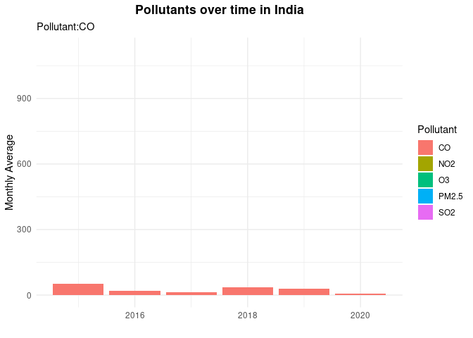

```{r setup, include=FALSE}
knitr::opts_chunk$set(echo = FALSE, message = FALSE, warning = FALSE)
```

```{r}
library(tidyverse)
library(lubridate)     
library(ggthemes)      
library(geofacet)     
library(maps)          # for map data
library(ggmap)         # for mapping points on maps
library(gplots)        # for col2hex() function
library(RColorBrewer)  # for color palettes
library(sf)            # for working with spatial data
library(leaflet)       # for highly customizable
library(gganimate)
library(openintro)
library(plotly)
library(maptools)
library(rgeos)
theme_set(theme_minimal())
```

```{r}
india_coordinates <- readr::read_csv('https://raw.githubusercontent.com/ayushi98/DS-project/main/Indian%20Cities%20Database.csv') #For Indian Cities' Latitude and Longitude
india_pollution <- readr::read_csv('https://raw.githubusercontent.com/ayushi98/DS-project/main/city_day.csv') #For Indian Cities' Pollution Levels
india_factories <- readr::read_csv('https://raw.githubusercontent.com/nicolehiggins/Pollution_Project/main/india_factory_data.csv') #For Indian Factories Data
pol_1980 <- read_csv("pol_1980.csv")
pol_2000 <- read_csv("pol_2000.csv")
pol_2015 <- read_csv("pol_2015.csv")
pol_2020 <- read_csv("pol_2020.csv")
```

```{r}
india_city_pollution <-
  india_pollution %>% 
  left_join(india_coordinates,
            by = c("City")) 

india_factory_pollution <-
  india_city_pollution %>% 
  left_join(india_factories,
            by = c("State" = "State/Union Territory"))

india_city_pollution2 <-
  india_pollution %>% 
  left_join(india_coordinates,
            by = c("City")) %>% 
  pivot_longer(cols = c("PM2.5", "NO2", "CO", "SO2", "O3","AQI"),
               names_to = "Pollutant",
               values_to = "degree_pollution") %>% 
  drop_na(degree_pollution) %>% 
  mutate(month = month(Date, label = TRUE),
         year = year(Date)) 
pol_1980 %>%
  summarise(`US AQI` = mean(AQI, na.rm = TRUE),
            `US CO` = mean(`CO Mean`, na.rm = TRUE),
            `US NO2` = mean(`NO2 Mean`, na.rm = TRUE),
            `US Ozone` = mean(`Ozone Mean`, na.rm = TRUE),
            `US SO2` = mean(`SO2 Mean`, na.rm = TRUE),
            year = "1980") -> nat_1980

pol_2000 %>%
  summarise(`US AQI` = mean(AQI, na.rm = TRUE),
            `US CO` = mean(`CO Mean`, na.rm = TRUE),
            `US NO2` = mean(`NO2 Mean`, na.rm = TRUE),
            `US Ozone` = mean(`Ozone Mean`, na.rm = TRUE),
            `US SO2` = mean(`SO2 Mean`, na.rm = TRUE),
            year = "2000") -> nat_2000

pol_2015 %>%
  summarise(`US AQI` = mean(AQI, na.rm = TRUE),
            `US CO` = mean(`CO Mean`, na.rm = TRUE),
            `US NO2` = mean(`NO2 Mean`, na.rm = TRUE),
            `US Ozone` = mean(`Ozone Mean`, na.rm = TRUE),
            `US SO2` = mean(`SO2 Mean`, na.rm = TRUE),
            year = "2015") -> nat_2015

pol_2020 %>%
  summarise(`US AQI` = mean(AQI, na.rm = TRUE),
            `US CO` = mean(`CO Mean`, na.rm = TRUE),
            `US NO2` = mean(`NO2 Mean`, na.rm = TRUE),
            `US Ozone` = mean(`Ozone Mean`, na.rm = TRUE),
            `US SO2` = mean(`SO2 Mean`, na.rm = TRUE),
            year = "2020") -> nat_2020

nat_sum <- nat_1980 %>%
  full_join(nat_2000,
            by = c("US AQI", "US CO", "US NO2", "US Ozone", "US SO2", "year")) %>%
  full_join(nat_2015,
            by = c("US AQI", "US CO", "US NO2", "US Ozone", "US SO2", "year")) %>%
  full_join(nat_2020,
            by = c("US AQI", "US CO", "US NO2", "US Ozone", "US SO2", "year"))
```

**Air Pollution in two Major Countries: India and The United States**

*Moderator*: Good morning! Thank you all for attending today’s webinar, where we explore recent air pollution trends in the US and India, looking at their causes and the ways in which they manifest. But before we get into that, why don’t you two talk a little bit about your backgrounds and why you’re interested in this area?

*American Scientist*: I’m a data scientist concentrating on the environment so this is basically a natural area of interest for me. But more to the point, pollution and air pollution aren’t typically at the forefront of political debates in the US especially since the passage of the Clean Air Act in 1963 but they do bear thinking about because even small amounts of air pollution can have negative health effects for many people. As such, I’m interested in looking at how the state of air pollution has changed in the US and why that’s happened.

*Indian Scientist*: I am an interdisciplinary social scientist, and through research and data analysis, I explore the links between industrial production, environmental degradation and public health in South Asia. As you might know, India is notorious for its dense, populous and polluted cities, and is home to 21 of 30 of the world’s most polluted cities. Within the country, as citizens experience record levels of air pollution every year, air pollution has come up as an important issue which needs to be intensively and urgently worked upon. Through my research, I hope to spread more awareness about how bad the air pollution truly is in India, and the myriad of interconnected factors that have led to this stage.

*Moderator*: Thank you for those introductions. As you researched air pollution, what was the data like for this topic? How is data collection different in each country?

*IN*: As I mentioned, air pollution is currently recognized as an urgent problem in India, which means that there is a lot of manpower and technology going into air pollution data collection and analysis. As such, there are over 200 air quality monitoring stations across the country, and several government and research institutions providing updated data for public perusal and awareness. The graphs that I will be sharing today use data ranging from 2015 to 2020, and are compiled from a couple of different sources, such as the Government of India website and Kaggle.com. Although there are a variety of data sets available, most of them capture recent air quality and have missing values for chunks of time or certain geographical areas.

*US*: By contrast, in the US the data collected by the EPA reaches back farther in time, to 1980, but collection is also somewhat spotty. For example, the data is collected by county but not all counties and not even all the states are represented in the datasets. Indeed, the counties and states from which data are collected vary through the years. As an example, take a look at these choropleth maps showing the mean AQI of US States in different years; some states simply aren’t on the map because there isn’t data for them. Despite this, there is enough data to show general trends over the years even if there are gaps.

```{r}

```

**Moderator**: What indicators do you use to measure air pollution?

*US*: One of the most common measurements of air pollution is [Air Quality Index](https://www.airnow.gov/aqi/aqi-basics/) or AQI which is a scale running from 0 to 500 in which 0 to 50 is good, 51 to 100 is moderate, 101 to 150 is unhealthy for sensitive groups, and values above 150 range from unhealthy to hazardous.  This can give us a rough estimate of the air pollution in a particular time or place.


*IN*: Although we use the AQI for a general measure of the air pollution, we also analyse the concentration of PM 2.5, or Particulate Matter 2.5, in the air. This refers to fine particulate matter under or equal to the width of two and a half microns, which is a result of different types of indoor and outdoor air pollution. Additionally, we also look at the concentrations of specific pollutants, such as Nitrogen Dioxide, Ozone, Carbon Monoxide and Sulfur Dioxide.  

*Moderator*: To start with, where is air pollution concentrated in both countries?

*IN*: As you can see in this graph, which depicts the highest AQIs for each of the Indian cities we analyse between 2015 and 2020, air pollution is the highest in the city of Ahmedabad, followed by the cities of Guwahati, Gurugram, Amritsar and Hyderabad respectively. These are all cities with at least a population of a million people each, and are spread out across the country as compared to being concentrated in a particular geographical area.


```{r, message=FALSE}
india <- get_stamenmap( bbox = c(left = 61.188, 
                                 bottom = 8.026, 
                                 right = 106.542, 
                                 top = 36.502), 
                        maptype = "toner-lite", zoom = 5)

ggmap(india)+
geom_point(data = india_city_pollution2 %>% filter(Pollutant == "AQI", year == "2020"),
           aes(x = Long, y = Lat, size = degree_pollution))+
theme(legend.background = element_blank(),
      legend.position = "bottomright")+
theme(plot.title = element_text(face="bold", hjust=0.5))+
labs(title = "AQI of Indian Cities in 2020") + 
  theme_map()
```

*US*: As the US has a smaller industrial base and tighter environmental regulations than India (which we’ll get more into later); the areas of worse air pollution tend to be in the southern states such as Mississippi, Tennessee, and Texas. The areas with the best air quality tend to be the ones with sparse populations in the west. For example, states in “Big Sky country” such as Wyoming and Montana tend to have AQI levels at or near 0.  

```{r, message=FALSE}
states_map <- map_data("state")

pol_2020 %>%
  ggplot() +
  geom_map(map = states_map,
           aes(map_id = str_to_lower(`State Name`),
               fill = AQI)) +
  expand_limits(x = states_map$long, y = states_map$lat) +
  theme_map() +
  theme(legend.position = "right",
        legend.background = element_blank(),
        plot.background = element_rect(fill = "#fff1e0")) +
  labs(title = "2020",
       fill = "Mg/Cubic Meter") +
  scale_fill_gradient(limits = c(0, 145),
                      low = "#fff88f",
                      high = "#8a3e04",
                      na.value = "#c9c9c9") -> AQI_map_2020
```
```{r}
AQI_map_2020
```


*Moderator*: How has this changed over time?

*US*: Looking at the data from 1980, we can see that there used to be a much stronger association between AQI and industry. As shown by the maps below, states having more industry, such as those in the midwest, had higher pollutant concentrations relative to others in 1980 than today. For example, look at the decrease in Sulfur Dioxide pollution in Michigan and Indiana since 1980.

```{r}

```

*IN*: There does not seem to be a significant increase or decrease in air pollution in major Indian cities between 2015 and 2020. As we can see in this graph, for certain cities like Amritsar and Ahmedabad, there is a slight peak in air pollution in 2018, other than which there are no apparent trends. However, we can see that there is a repeating, annual pattern in air pollution in several cities, which I will delve into later.


```{r}
india_city_pollution %>% 
  ggplot(aes(x = Date, y = AQI, color = City)) +
  geom_line() +
  facet_wrap(vars(City)) +
  theme(plot.title = element_text(face="bold", hjust=0.5))+
  labs(title = "Air Quality Index in Major Indian Cities from 2015-2020")+
  theme(legend.position = "none")
```

*Moderator*: Does the composition of air pollution change over time too? What does this indicate?

*US*: When we look at charts showing the national mean for our main pollutant indicators over time,we can see some interesting things happening. The main takeaway is that the level of air pollution has improved a lot since 1980. Mean AQI dropped from 30.6 to 18.1, and all the pollutants except ozone experienced a net decrease. However, both overall AQI and NO₂ have slightly risen since 2015, this may be a result of loosening of air quality regulations by the Trump administration.

```{r}
nat_sum %>%
  pivot_longer(cols = c(`US AQI`, `US CO`, `US NO2`, `US Ozone`, `US SO2`),
               names_to = "pollutants",
               values_to = "mean") %>%
  mutate(scaled = ifelse(pollutants == "US AQI", mean/2,
                         ifelse(pollutants == "US CO", mean*10,
                                ifelse(pollutants == "US NO2", mean*.75,
                                       ifelse(pollutants == "US SO2", mean*1.6,
                                              mean*300))))) %>%
  ggplot(aes(x = year, y = scaled, fill = pollutants)) +
  geom_col() +
  geom_text(aes(label = round(mean, digits = 3)), 
            nudge_y = 1, 
            size = 3) +
  facet_wrap(vars(pollutants)) +
  theme(axis.text.y = element_blank(),
        axis.title.x = element_blank(),
        axis.title.y = element_blank(),
        legend.position = "none",
        title = element_text(face = "bold"))
```


*IN*: When we look at the change in types of pollutants from 2015-2020 in India, it seems that the concentration of each of these pollutants has decreased significantly in 2020. The scientific consensus is that this is mainly due to the national lockdown that was imposed as a result of the COVID-19 pandemic, which led to an overall decrease in industrial production and transportation. As we see in this graph, other than PM2.5 pollutants which seem to be generally decreasing even before 2020, each of the other pollutants maintain a relatively stable level 
without too much deviation.


```{r}
india_pollutants<-
  india_city_pollution2 %>% 
  group_by(month,Pollutant, year) %>% 
  filter(Pollutant != "AQI") %>% 
  summarize(mean_monthly = mean(degree_pollution)) %>%
  ungroup() %>% 
  ggplot(aes(x = year, y = mean_monthly, fill = Pollutant))+
  geom_col()+
  theme(plot.title = element_text(face="bold", hjust=0.5))+
  labs(title = "Pollutants over time in India",
       subtitle = "Pollutant:{closest_state}",
       y = "Monthly Average",
       x = "")+
  transition_states(Pollutant)

anim_save("pollution_over_time.gif", india_pollutants)  
```

```{r}

```

*Moderator*: Are there any trends you notice that might indicate certain causes for the pollution in these countries?

*IN*: There are a couple of important trends to note in regards to air pollution in the Indian context. Firstly, is the effect of seasonality. As we see in this graph, and as I mentioned earlier, there is significant change in air pollution across different months of the year. Across the years, pollution is generally the highest during the months of November to February, and lowest during the months of July to September. This is because of a combination of complex factors. October marks the withdrawal of monsoon in India, during which the prevalent direction of winds is easterly. 

During the following winter and summer, the winds shift to a northwesterly direction, and carry dust to the mainland from the desert state of Rajasthan and sometimes Afghanistan and Pakistan. Additionally, as the temperatures dip in the winter, the inversion height - which is the layer beyond which pollutants cannot disperse into the atmosphere - is lowered. This leads to an increase in the concentration of pollutants in the air, and makes Indian cities especially unhealthy for their residents in the winter.


```{r}
pollution_season<-
india_city_pollution2 %>% 
  filter(Pollutant!="AQI") %>% 
  group_by(month,Pollutant, year) %>% 
  summarize(mean_monthly = mean(degree_pollution)) %>%
  arrange(year) %>% 
  ggplot(aes(x = month, y = mean_monthly), position = position_stack())+
  geom_col(aes(fill = Pollutant))+
  theme(plot.title = element_text(face="bold", hjust=0.5))+
  labs(title = "Pollution by Season in India",
       x = "",
       y = "Monthly Average")+
  scale_fill_viridis_d(option = "plasma")

ggplotly(pollution_season,
         tooltip = c("text", "y"))
```

Another important trend is the distribution of industrial production across the country. As we see in the following graph, certain Indian states such as Tamil Nadu, Maharashtra, Gujarat and Ahmedabad have the highest numbers of manufacturing facilities. There is a significant overlap between the states with high manufacturing and high AQI, indicating that industrial pollution is a significant cause for air pollution in regions across India.


```{r}

india <- get_stamenmap(
    bbox = c(left = 61.188, bottom = 8.026, right = 106.542, top = 36.502), 
    maptype = "toner-lite",
    zoom = 5)
    
ggmap(india) +
  geom_point(data = india_factory_pollution,
             aes(x = Long, y = Lat, size = `Number of Factories - 2014-15` ))+
  labs(title = "Number of Factories in 2015 in Indian States",
       x = "",
       y = "") +
  theme(plot.title = element_text(face="bold", hjust=0.5))
```

*US*: One factor that has an effect on air pollution is increasing vehicle fuel efficiency. As shown in this graph, cars in the US today get many more miles per gallon of gas than they did in 1980. This undoubtedly had a positive effect on AQI as cars, one of the biggest emitters of air pollutants, became cleaner.

```{r}
cars <- read_csv("cars.csv", 
                 col_types = cols(year = col_character())) 
nat_sum %>% 
  full_join(cars, by = "year") %>% 
  ggplot(aes(x = year)) + 
  geom_col(aes(y = `US AQI`), fill = "#ffa012") + 
  geom_line(aes(year, MPG, group = 1), size = 2) + 
  geom_point(aes(y = MPG), size = 3) + 
  labs(y = "AQI / MPG", 
       title = "Comparing Miles per Gallon to US Air Quality") + 
  theme(axis.title.y = element_text(face = "bold"),
        axis.title.x = element_blank(), 
        title = element_text(face = "bold"), 
        plot.background = element_rect(fill = "#bcb8c2")) -> AQIcars 

AQIcars %>% ggplotly()
```

*Moderator*: Do environmental policies or legislation play a role in the change in air pollution levels over the years you analysed?

*US*: Government policy definitely plays a big role in the change in US air pollution. The most influential US legislation on air pollution is the 1963 Clean Air act, which was amended and expanded in 1990. A [study](https://doi.org/10.1257%2Faer.20151272) by researchers at UC Berkeley found that the clean air act was responsible for 60% of the drop in pollution from manufacturing in the US from 1990 and 2008. On the flipside, as alluded to previously, some of the rise in AQI since 2015 could be attributed to the [rollback of almost 30 federal rules](https://www.nytimes.com/interactive/2020/climate/trump-environment-rollbacks.html) by the Trump administration related to air pollution.

*IN*: Governmental policy does not play a big role in air pollution levels between 2015-2020, but presumably did in earlier decades when crucial legislation was passed. To understand the effect of policy on air pollutants, we would have to analyse the 1970s-80s time period, since the landmark Air (Prevention and Control of Pollution) act was passed in 1981. 

*Moderator*: Thank you both so much for your time, this has been an extremely interesting and informative session. Thank you to all the viewers for attending this webinar - you can find the speakers’ data sources at the following links. See you next time!

