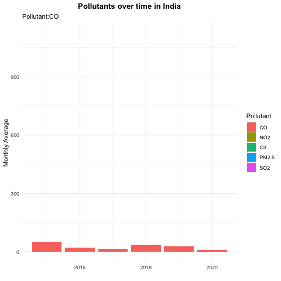

```{r setup, include=FALSE}
knitr::opts_chunk$set(echo = TRUE)
```

```{r}
library(tidyverse)
library(lubridate)     
library(ggthemes)      
library(geofacet)     
library(maps)          # for map data
library(ggmap)         # for mapping points on maps
library(gplots)        # for col2hex() function
library(RColorBrewer)  # for color palettes
library(sf)            # for working with spatial data
library(leaflet)       # for highly customizable
library(gganimate)
library(openintro)
library(plotly)
library(maptools)
library(rgeos)
theme_set(theme_minimal())
```


```{r}
india_coordinates <- readr::read_csv('https://raw.githubusercontent.com/ayushi98/DS-project/main/Indian%20Cities%20Database.csv') #For Indian Cities' Latitude and Longitude
india_pollution <- readr::read_csv('https://raw.githubusercontent.com/ayushi98/DS-project/main/city_day.csv') #For Indian Cities' Pollution Levels
india_factories <- readr::read_csv('https://raw.githubusercontent.com/nicolehiggins/Pollution_Project/main/india_factory_data.csv') #For Indian Factories Data
```

```{r}
india_city_pollution <-
  india_pollution %>% 
  left_join(india_coordinates,
            by = c("City")) 

india_factory_pollution <-
  india_city_pollution %>% 
  left_join(india_factories,
            by = c("State" = "State/Union Territory"))
```


```{r}
india_city_pollution2 <-
  india_pollution %>% 
  left_join(india_coordinates,
            by = c("City")) %>% 
  pivot_longer(cols = c("PM2.5", "NO2", "CO", "SO2", "O3","AQI"),
               names_to = "Pollutant",
               values_to = "degree_pollution") %>% 
  drop_na(degree_pollution) %>% 
  mutate(month = month(Date, label = TRUE),
         year = year(Date)) 

```


```{r}
india_city_pollution %>% 
  ggplot(aes(x = Date, y = AQI, color = City)) +
  geom_line() +
  facet_wrap(vars(City)) +
  labs(title = "Air Quality Index in Major Indian Cities from 2015-2020")+
  theme(legend.position = "none")
 
```


```{r}
max_aqi <- india_city_pollution %>%
  select(City, Date, AQI) %>% 
  group_by(City) %>% 
  summarise(city_max_AQI = max(AQI, na.rm = TRUE)) %>% 
  ggplot(aes(x = city_max_AQI, y = fct_reorder(City, city_max_AQI, .desc = TRUE)))+
  geom_col(fill = "DarkBlue")+
  labs(x = "", 
       y = "",
       title = "Highest AQIs for Major Indian Cities between 2015-2020")+
  theme_clean()

ggplotly(max_aqi,
         tooltip = c("text", "x"))
```

```{r}
min_aqi <- india_city_pollution %>%
  select(City, Date, AQI) %>% 
  group_by(City) %>% 
  summarise(city_min_AQI = min(AQI, na.rm = TRUE)) %>% 
  ggplot(aes(x = city_min_AQI, y = fct_reorder(City, city_min_AQI, .desc = TRUE))) +
  geom_col(fill = "Orange")+
  labs(x = "", 
       y = "",
       title = "Lowest AQIs for Major Indian Cities between 2015-2020")+
  theme_clean()

ggplotly(min_aqi,
         tooltip = c("AQI", "x"))
```

**#2**

```{r}
india_city_pollution2 %>% 
  filter(Pollutant!="AQI",
         State != "NA") %>% 
  group_by(Pollutant, State) %>% 
  summarize(max_state = max(degree_pollution)) %>% 
  ggplot(aes(x = max_state, y = State)) +
  geom_col(aes(fill  = Pollutant))+
  facet_wrap(~Pollutant, scales = "free_x")+
  theme(legend.position = "none",
        axis.title.y = element_text(size = 15))+
  labs(title = "Highest Pollutants in each State between 2015-2020",
       y = "",
       x = "Degree of Pollution")
  
```

```{r}
indian_states <- st_read("Igismap/Indian_States.shp", quiet = TRUE) %>% 
  filter(st_nm != "Andaman & Nicobar Island",
         st_nm != "Lakshadweep") %>% 
  left_join(india_city_pollution2,
            by = c("st_nm" = "State"))
```


```{r}
indian_states %>% 
  ggplot()+ 
  geom_sf(aes(fill = degree_pollution))
```

**#4**
```{r}
india_pollutants<-
  india_city_pollution2 %>% 
  group_by(month,Pollutant, year) %>% 
  summarize(mean_monthly = mean(degree_pollution)) %>%
  ungroup() %>% 
  ggplot(aes(x = year, y = mean_monthly, fill = Pollutant))+
  geom_col()+
  labs(title = "Pollutants over time in India",
       subtitle = "Pollutant:{closest_state}",
       y = "Monthly Average",
       x = "")+
  transition_states(Pollutant)

anim_save("pollution_over_time.gif", india_pollutants)  
```

```{r}

```


**#6**
```{r}
pollution_season<-
india_city_pollution2 %>% 
  filter(Pollutant!="AQI") %>% 
  group_by(month,Pollutant, year) %>% 
  summarize(mean_monthly = mean(degree_pollution)) %>%
  arrange(year) %>% 
  ggplot(aes(x = month, y = mean_monthly), position = position_stack())+
  geom_col(aes(fill = Pollutant))+
  labs(title = "Pollution by Season in India",
       x = "",
       y = "Monthly Average")+
  scale_fill_viridis_d(option = "plasma")

ggplotly(pollution_season,
         tooltip = c("text", "y"))
```


```{r}
india <- get_stamenmap(
    bbox = c(left = 61.188, bottom = 8.026, right = 106.542, top = 36.502), 
    maptype = "toner-lite",
    zoom = 5)

ggmap(india)+
geom_point(data = india_city_pollution2 %>% filter(Pollutant != "AQI"),
           aes(x = Long, y = Lat, color = Pollutant, size = degree_pollution))+
theme(legend.background = element_blank(),
      legend.position = "bottomright")+
  facet_wrap(~Pollutant)+
  theme_map()
```

MAP 1: Distribution of AQI

```{r}
ggmap(india)+
geom_point(data = india_city_pollution2 %>% filter(Pollutant == "AQI"),
           aes(x = Long, y = Lat, size = degree_pollution))+
theme(legend.background = element_blank(),
      legend.position = "bottomright")+
  theme_map()
```

```{r}
ggmap(india)+
geom_point(data = india_city_pollution2, 
           aes(x = Long, y = Lat, color = degree_pollution))+
  facet_wrap(~Pollutant)+
  theme(legend.background = element_blank())+
  theme_map()
```

```{r}
india_factories %>% 
  select(`State/Union Territory`, `Number of Factories - 2014-15`) %>% 
  arrange(desc(`Number of Factories - 2014-15`)) %>% 
  ggplot(aes(x = `Number of Factories - 2014-15`, y = fct_reorder(`State/Union Territory`,`Number of Factories - 2014-15`, .desc = TRUE ))) +
  geom_col(fill = "DarkBlue") +
  labs(x = "", 
       title = "Number of Factories in Indian States", 
       y = "")+
  theme_clean()

```

```{r}

india <- get_stamenmap(
    bbox = c(left = 61.188, bottom = 8.026, right = 106.542, top = 36.502), 
    maptype = "toner-lite",
    zoom = 5)
    
ggmap(india) +
  geom_point(data = india_factory_pollution,
             aes(x = Long, y = Lat, size = `Number of Factories - 2014-15` ))+
  labs(title = "Number of Factories in 2015 in major Indian Cities",
       x = "",
       y = "")
```
```{r}
india_factory_pollution %>% 
  #select(`State/Union Territory`, `Number of Factories - 2014-15`) %>% 
  group_by(City) %>% 
  arrange(desc(`Number of Factories - 2014-15`)) %>% 
```


