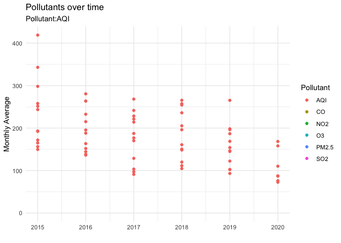

```{r setup, include=FALSE}
knitr::opts_chunk$set(echo = TRUE)
```

```{r}
library(tidyverse)
library(lubridate)     
library(ggthemes)      
library(geofacet)     
library(maps)          # for map data
library(ggmap)         # for mapping points on maps
library(gplots)        # for col2hex() function
library(RColorBrewer)  # for color palettes
library(sf)            # for working with spatial data
library(leaflet)       # for highly customizable
library(gganimate)
library(openintro)
library(plotly)
library(maptools)
library(rgeos)
theme_set(theme_minimal())
```


```{r}
india_coordinates <- readr::read_csv('https://raw.githubusercontent.com/ayushi98/DS-project/main/Indian%20Cities%20Database.csv') #For Indian Cities' Latitude and Longitude
india_pollution <- readr::read_csv('https://raw.githubusercontent.com/ayushi98/DS-project/main/city_day.csv') #For Indian Cities' Pollution Levels
india_factories <- readr::read_csv('https://raw.githubusercontent.com/nicolehiggins/Pollution_Project/main/india_factory_data.csv') #For Indian Factories Data
```

```{r}
india_city_pollution <-
  india_pollution %>% 
  left_join(india_coordinates,
            by = c("City")) 

india_factory_pollution <-
  india_city_pollution %>% 
  left_join(india_factories,
            by = c("State" = "State/Union Territory"))
```


```{r}
india_city_pollution2 <-
  india_pollution %>% 
  left_join(india_coordinates,
            by = c("City")) %>% 
  pivot_longer(cols = c("PM2.5", "NO2", "CO", "SO2", "O3","AQI"),
               names_to = "Pollutant",
               values_to = "degree_pollution") %>% 
  drop_na(degree_pollution) %>% 
  mutate(month = month(Date, label = TRUE),
         year = year(Date)) 

```


```{r}
india_city_pollution %>% 
  ggplot(aes(x = Date, y = AQI, color = City)) +
  geom_line() +
  facet_wrap(vars(City)) +
  labs(title = "Air Quality Index in Major Indian Cities from 2015-2020")+
  theme(legend.position = "none")
 
```


```{r}
max_aqi <- india_city_pollution %>%
  select(City, Date, AQI) %>% 
  group_by(City) %>% 
  summarise(city_max_AQI = max(AQI, na.rm = TRUE)) %>% 
  ggplot(aes(x = city_max_AQI, y = City)) +
  geom_col(fill = "DarkBlue")+
  labs(x = "", 
       y = "",
       title = "Highest AQIs for Major Indian Cities between 2015-2020")

ggplotly(max_aqi,
         tooltip = c("text", "x"))
```

```{r}
min_aqi <- india_city_pollution %>%
  select(City, Date, AQI) %>% 
  group_by(City) %>% 
  summarise(city_min_AQI = min(AQI, na.rm = TRUE)) %>% 
  ggplot(aes(x = city_min_AQI, y = City)) +
  geom_col(fill = "Orange")+
  labs(x = "", 
       y = "",
       title = "Lowest AQIs for Major Indian Cities between 2015-2020")

ggplotly(min_aqi,
         tooltip = c("text", "x"))
```

**#2**

```{r, fig.height=4.5}
india_city_pollution2 %>% 
  filter(Pollutant!="AQI") %>% 
  group_by(Pollutant, State) %>% 
  summarize(max_state = max(degree_pollution)) %>% 
  ggplot(aes(x = max_state, y = State)) +
  geom_col(aes(fill  = Pollutant))+
  facet_wrap(~Pollutant, scales = "free_x")+
  theme(legend.position = "none")+
  labs(title = "Highest Pollutants in each State",
       y = "",
       x = "Degree of Pollution")
  
```

```{r}
indian_states <- st_read("Igismap/Indian_States.shp", quiet = TRUE)
```

**#4**
```{r}
india_pollutants<-
  india_city_pollution2 %>% 
  group_by(month,Pollutant, year) %>% 
  summarize(mean_monthly = mean(degree_pollution)) %>%
  ungroup() %>% 
  ggplot(aes(x = year, y = mean_monthly, color = Pollutant))+
  geom_point()+
  labs(title = "Pollutants over time",
       subtitle = "Pollutant:{closest_state}",
       y = "Monthly Average",
       x = "")+
  transition_states(Pollutant)

anim_save("pollutant_over_time.gif", india_pollutants)  
```

```{r}

```


**#6**
```{r}
pollution_season<-
india_city_pollution2 %>% 
  filter(Pollutant!="AQI") %>% 
  group_by(month,Pollutant, year) %>% 
  summarize(mean_monthly = mean(degree_pollution)) %>%
  arrange(year) %>% 
  ggplot(aes(x = month, y = mean_monthly), position = position_stack())+
  geom_col(aes(fill = Pollutant))+
  labs(title = "Pollution by Season in India",
       x = "",
       y = "Monthly Average")+
  scale_fill_viridis_d(option = "plasma")

ggplotly(pollution_season,
         tooltip = c("text", "y"))
```


```{r}
india <- get_stamenmap(
    bbox = c(left = 61.188, bottom = 8.026, right = 106.542, top = 36.502), 
    maptype = "terrain",
    zoom = 5)

ggmap(india)+
geom_point(data = india_city_pollution2,
           aes(x = Long, y = Lat, color = Pollutant, size = ))+
  facet_wrap(~year)+
  theme(legend.background = element_blank())+
  theme_map()
```

```{r}
ggmap(india)+
geom_point(data = india_city_pollution2, 
           aes(x = Long, y = Lat, color = degree_pollution))+
  facet_wrap(~Pollutant)+
  theme(legend.background = element_blank())+
  theme_map()
```

```{r}
india_factories %>% 
  select(`State/Union Territory`, `Number of Factories - 2014-15`) %>% 
  arrange(desc(`Number of Factories - 2014-15`)) %>% 
  ggplot(aes(x = `Number of Factories - 2014-15`, y = `State/Union Territory`)) +
  geom_col(fill = "DarkBlue") +
  labs(x = "Number of Factories in 2015", title = "Number of Factories in Indian States")

```

```{r}

```


```{r}
mean_aqi <- 
  india_city_pollution2 %>%
  group_by(State) %>% 
  summarise(state_mean_AQI = mean(AQI, na.rm = TRUE)) %>% 

ggmap(india)+
  geom_point(data = mean_aqi, 
           aes(x = Long, y = Lat, color = state_mean_AQI))+
  #facet_wrap(~Pollutant)+
  theme(legend.background = element_blank())+
  theme_map()
```